# Property CRM — Domain Model & ERD

**Deliverable 1 of 7 · Status: awaiting review** — no code or migrations until this is approved.

| Decision | Locked choice |
|---|---|
| Stack | TypeScript / NestJS · PostgreSQL 16 + PostGIS · Redis + BullMQ |
| Identity provider | Keycloak (CRM stores only the opaque `subject_id`) |
| Exclusivity & attribution | Exclusive window, sole credit (default 30 days from showing; every touch snapshotted so a split policy can be layered on later) |
| Operating model | Hybrid — scraped listings staff-mediated until the owner registers and verifies, then self-serve |

Conventions used throughout: every table gets `id uuid PK`, `created_at` / `updated_at timestamptz`, and a trigger-maintained `sync_seq bigint` (global sequence) for delta sync. All timestamps are `timestamptz`; scheduling logic computes in the property's IANA timezone (derived at geocode time). Diagrams show the columns that carry a design decision — exhaustive column lists arrive with Deliverable 2 (migrations).

---

## 1 · Module map

Thirteen NestJS modules, one Postgres schema each where isolation pays for itself (`audit`, `privacy`) and a shared `core` schema for the rest:

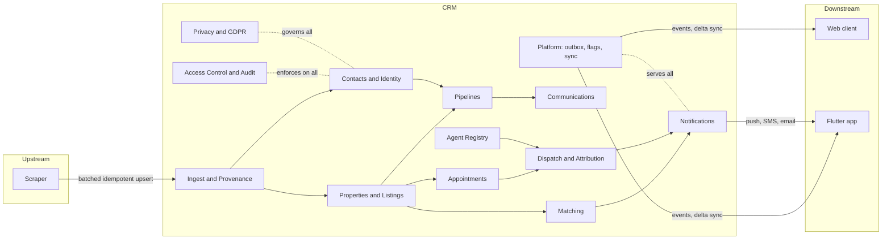

---

## 2 · Contacts & identity

A **contact is one human** (or one organisation via `ORGANISATION`); roles are attached rows with independent lifecycles, never subtypes. The Keycloak `subject_id` is the only identity link — email is a channel, never a key. Direct identifiers that need KMS field encryption live in a separate 1:1 table so the main row never carries them.

```mermaid
erDiagram
  CONTACT ||--o{ CONTACT_ROLE : "holds"
  CONTACT ||--o{ CONTACT_CHANNEL : "reachable via"
  CONTACT ||--o| CONTACT_SENSITIVE : "encrypted ids"
  CONTACT ||--o{ ORG_MEMBERSHIP : "belongs to"
  ORGANISATION ||--o{ ORG_MEMBERSHIP : "employs"
  CONTACT ||--o{ CONTACT_RELATIONSHIP : "linked from"
  CONTACT ||--o{ CONTACT_MERGE : "merge history"

  CONTACT {
    uuid id PK
    text idp_subject_id UK "nullable until registered, opaque Keycloak sub"
    text lifecycle_state "unregistered, invited, registered, identity_verified, suspended, erased"
    text locale "fr, nl, en"
    text timezone
    boolean processing_restricted "GDPR Art 18 freeze flag"
    uuid dek_id "per-subject data encryption key, destroyed on erasure"
  }
  CONTACT_ROLE {
    uuid contact_id FK
    text role "owner, buyer, renter, agent, staff"
    text state "active, dormant, ended"
    timestamptz activated_at
    timestamptz ended_at
  }
  CONTACT_CHANNEL {
    uuid contact_id FK
    text kind "email, phone"
    text value_normalised "E164 for phone, lowercased for email"
    text verification_state "unverified, pending, verified, bounced"
    boolean is_preferred
  }
  CONTACT_SENSITIVE {
    uuid contact_id PK
    bytea national_id_enc "KMS envelope encrypted"
    bytea iban_enc "KMS envelope encrypted"
  }
  ORGANISATION {
    uuid id PK
    text kind "agency, corporate_landlord"
    text name
    text registration_number
  }
  ORG_MEMBERSHIP {
    uuid contact_id FK
    uuid organisation_id FK
    text role_in_org
    daterange validity
  }
  CONTACT_RELATIONSHIP {
    uuid from_contact_id FK
    uuid to_contact_id FK
    text kind "co_owner, power_of_attorney, tenant_of_record"
    daterange validity
  }
  CONTACT_MERGE {
    uuid surviving_id FK
    uuid absorbed_id FK
    jsonb pre_merge_snapshot "full state of both records for unmerge"
    timestamptz merged_at
    uuid merged_by FK
    timestamptz unmerged_at "null unless reversed"
  }
```

**Merge/unmerge:** merging re-points child rows to the survivor and stores a full JSONB snapshot of both records plus the re-pointing map; unmerge replays the map in reverse. The absorbed row stays as a tombstoned alias so inbound references (ingest dedupe keys, inbound email routing) still resolve. Every merge and unmerge is also an audit event.

**Account lifecycle** (spec-given, enforced as a state machine on `CONTACT.lifecycle_state`): `unregistered → invited → registered → identity_verified`, with `suspended` reachable from and returnable to any active state, and `erased` terminal (row pseudonymised, DEK destroyed, suppression entries written).

---

## 3 · Properties & listings

**Property** is the durable physical asset; a **listing** is one marketing episode (sale *or* rent) of that property. A property accumulates listings over the years; at most one *active* listing per channel is enforced by a partial unique index. The spec's lifecycle state machine (§7 below) lives on the listing, not the property.

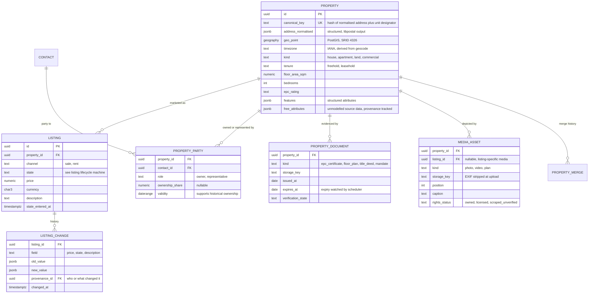

**Canonical key:** `sha256(country | normalised_street | number | unit | postcode)` from libpostal-normalised components — deliberately *not* derived from geocoder output, so a geocoder version bump can't fork identities. The geocode (point, timezone, confidence) is stored alongside with its own provenance row. Cross-source near-duplicates (fuzzy address + <25 m distance) are surfaced to the quarantine queue rather than auto-merged.

---

## 4 · Ingest, provenance & suppression

Every provenance-bearing field write flows through one **resolver**: the incoming value wins only if its method outranks the current value's method (`staff_verified > owner_submitted > scraped`, overridable per field via `FIELD_PRECEDENCE_RULE`). A losing value isn't discarded — it's parked as `candidate_value` on the provenance row, visible in the review UI. This is what makes "owner-confirmed always supersedes scraped" structural rather than conventional.

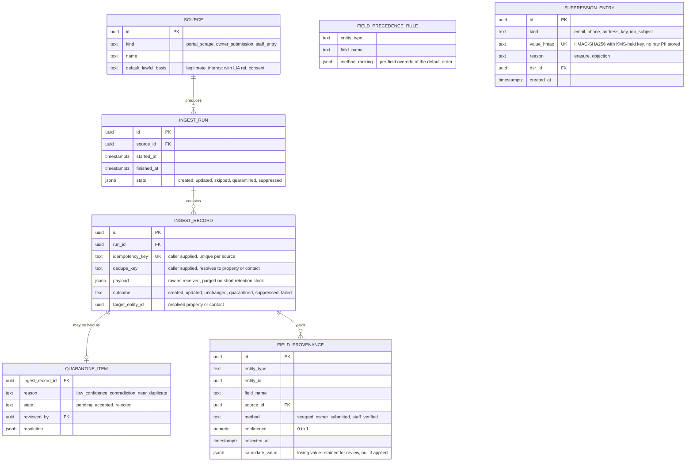

**Suppression at ingest:** the suppression list stores only keyed HMACs of normalised identifiers — it must not itself retain the PII it exists to erase. The ingest pipeline HMACs every incoming email/phone/address key and drops matches with outcome `suppressed` *before* any entity write, so an erased owner rescraped next week never rematerialises. Replay: re-posting a batch with the same idempotency keys returns the recorded outcomes without side effects.

---

## 5 · Pipelines, tasks & activity

Supply and demand are two rows in `PIPELINE`, not two schemas — stages, SLAs and routing are configuration. `PIPELINE_ITEM` is the lead; `ACTIVITY` is the single append-only timeline every module writes to (one query serves both the contact view and the property view).

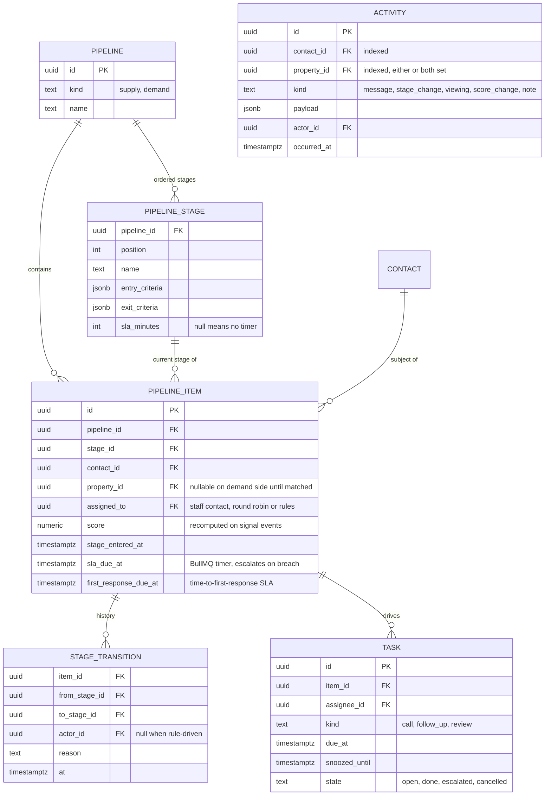

**Time-to-first-response:** `first_response_due_at` is stamped when an inbound inquiry creates or touches an item; the first outbound staff/agent action clears it; a BullMQ delayed job fires escalation if it survives past the SLA. It is deliberately its own column, not a generic stage SLA — the spec calls it the single most conversion-critical metric and it must survive stage reconfiguration.

**Matching** hangs off the demand side: `REQUIREMENT_PROFILE` (budget range, PostGIS multipolygon *or* postcode list, bedrooms, must-haves/deal-breakers as JSONB) and `MATCH` (profile × listing, score, state `new → alerted → dismissed | interested`, feedback captured on state change and fed back into scoring weights). Alert fan-out is an event to Notifications with per-profile frequency capping.

---

## 6 · Communications & compliance gate

Every outbound message passes a **pre-send gate** whose verdict is persisted — consent/lawful basis, suppression check, quiet hours, and whether an Article 14 disclosure must ride along. A message without a passing `COMPLIANCE_CHECK` row cannot reach a provider adapter; that is enforced in code as the only send path.

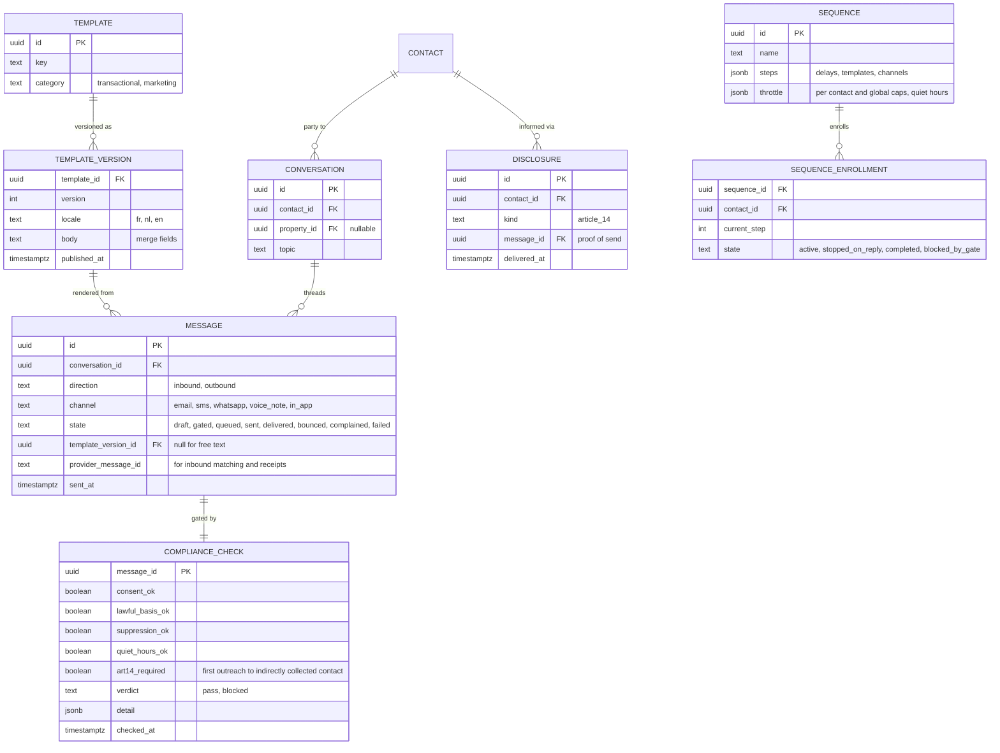

Inbound routing resolves `provider_message_id` / reply-to token → conversation, falling back to verified channel value → contact. Delivery, bounce, complaint and unsubscribe callbacks update `MESSAGE.state` and write channel-level suppression (a complaint hard-stops the channel, not the contact).

---

## 7 · Appointments, access & post-visit

Booking is a three-way availability intersection — viewer, agent, **and property access** — resolved against Postgres range types with GiST exclusion constraints, so a double-booking is impossible at the database layer, not just the application layer:

```sql
ALTER TABLE appointment ADD CONSTRAINT no_agent_overlap
  EXCLUDE USING gist (agent_id WITH =, during WITH &&)
  WHERE (state IN ('booked','confirmed','in_progress'));
-- same shape for property_id; slot_holds join the constraint while unexpired
```

`during` includes the agent's travel buffer. Minimum notice for tenanted properties is validated in the property's timezone at slot-generation *and* at booking (the rule may have changed between the two).

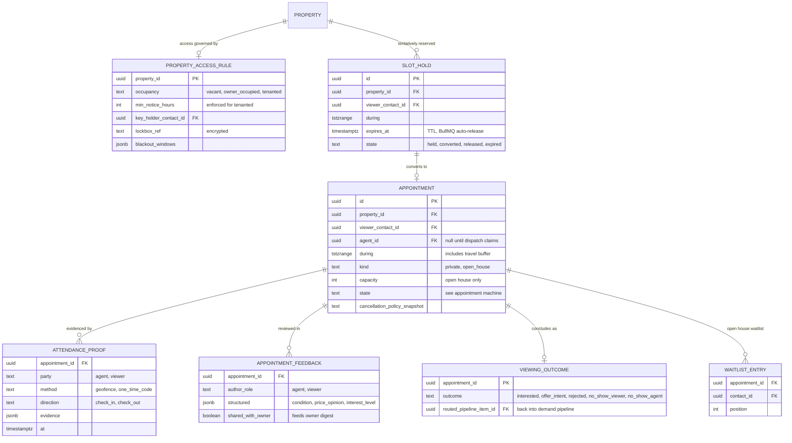

Reminders (T-24h, T-2h) are scheduler jobs per appointment per party; calendar integration is an outbound iCal feed (token per agent) plus optional two-way Google/Outlook sync via a `CALENDAR_LINK` row holding provider sync cursors.

---

## 8 · Agent registry

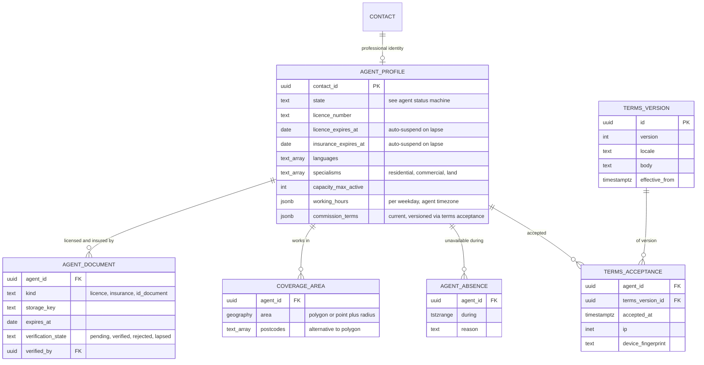

The **scorecard** (claim rate, punctuality from attendance proofs, no-show rate, feedback average) is a materialised view refreshed on a schedule — derived, never hand-edited, and it feeds directly into dispatch ranking. A nightly job plus a document-write trigger flips agents to `suspended` the moment a licence or insurance document lapses; suspension removes them from dispatch candidacy atomically with the state change.

---

## 9 · Dispatch, claim & attribution

The heart of the system. One `DISPATCH` per appointment needing an agent; candidates are ranked and offered per the configured strategy; **the claim is a single conditional UPDATE** — the winner is whoever's transaction flips the row:

```sql
UPDATE dispatch
   SET state = 'claimed', winning_offer_id = :offer_id, claimed_at = now()
 WHERE id = :dispatch_id
   AND state = 'offering'
   AND winning_offer_id IS NULL;
```

Row count 1 → winner: same transaction marks the offer `claimed`, sibling offers `withdrawn`, creates the `ASSIGNMENT_AGREEMENT`, the purpose-bound `ACCESS_GRANT` (§11), and the outbox event. Row count 0 → if `winning_offer_id = :offer_id` it's an idempotent replay (return success), otherwise a clean `409 already_claimed`. Claims are **online-only**: the claim endpoint rejects any request bearing the offline-queue idempotency header, and claims are excluded from the client sync contract. This exact race is covered by the mandated concurrency test (parallel claimers, exactly one winner).

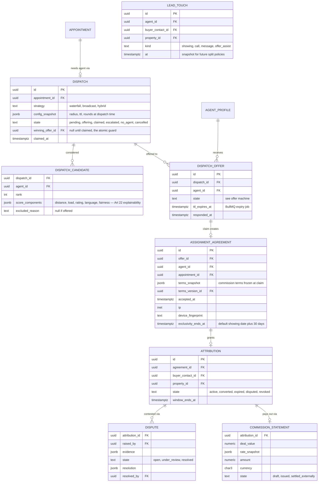

**Escalation ladder** (state `escalated`, loops back to `offering` with widened parameters): no claim → widen radius → relax criteria (language, specialism) → alert ops → `no_agent` fallback (staff-assigned or viewer notified). Every rung is recorded; `DISPATCH_CANDIDATE.score_components` is retained for the Article 22 explanation path and the ops board's manual override writes the same audit trail.

**Attribution policy (locked):** sole credit within `exclusivity_ends_at`; `LEAD_TOUCH` records every agent interaction anyway, so a future split policy is a new calculator over existing data, not a migration.

---

## 10 · Notifications

Delivery is never assumed. Time-critical categories (dispatch offers) require a **client ACK**; a missing ACK within the per-step timer escalates down the fallback chain push → SMS → email. Tray accept/decline actions hit the same claim endpoint with the same atomicity.

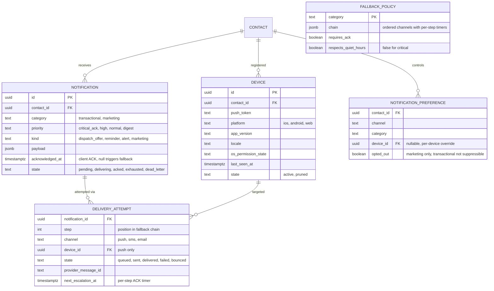

Provider failure responses (`Unregistered`, `BadDeviceToken`) prune tokens automatically. Quiet hours apply to non-urgent categories only, evaluated in the *recipient's* timezone. Retries use exponential backoff; exhausted chains land in `dead_letter` state surfaced on the ops board.

---

## 11 · Access control, audit & security

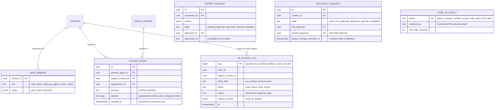

**Purpose-bound temporal grants:** claiming a showing creates an `ACCESS_GRANT` scoped to that viewer, that appointment, that window. Outside a live grant, agents see masked contact details (`j***@***.com`); reveal-on-click requires a reason and writes a `reveal` row to `PII_ACCESS_LOG`. The log is insert-only at the Postgres-role level — the application user has no UPDATE/DELETE on those partitions — and records **reads as well as writes**. Step-up enforcement is delegated to Keycloak ACR: the API checks the token's ACR/auth-age against `STEP_UP_POLICY` and returns a `step_up_required` challenge.

---

## 12 · Privacy & GDPR

Two clusters: *basis & consent* (why we may process) and *rights & retention* (what the subject may demand and when data dies).

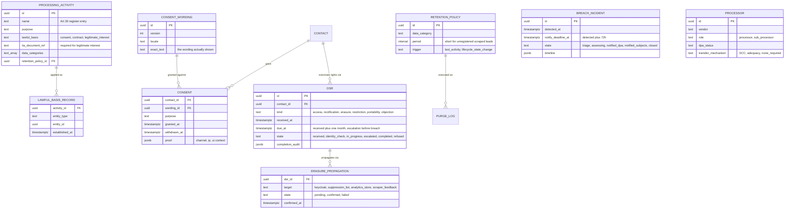

**Erasure** is a pipeline, not a delete: pseudonymise the contact row, destroy the per-subject DEK (crypto-shredding — §13), write suppression HMACs, propagate to Keycloak (admin API delete) and the analytics store, and record each confirmation on `ERASURE_PROPAGATION`. **Restriction** sets `processing_restricted`, which the pipeline engine, matcher, sequencer and dispatcher all check — the record is held but inert. Retention clocks run per category via nightly scheduler with a `PURGE_LOG` of what was destroyed and under which policy.

---

## 13 · Platform: outbox, sync, idempotency

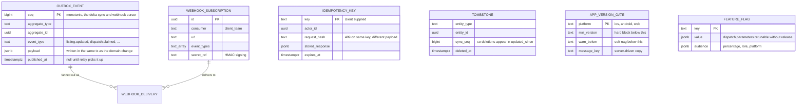

- **Delta sync:** `GET /sync?updated_since=<seq>` returns changed rows + tombstones ordered by `sync_seq` (a global sequence stamped by trigger — no clock-skew ambiguity), with ETag support on single resources.
- **Offline writes:** accepted with client idempotency keys; server-authoritative on anything with a state machine, last-write-wins only on free text. **Claims are excluded** — online-only by contract.
- **Crypto-shredding & backups:** direct identifiers are envelope-encrypted with a per-subject DEK (`CONTACT.dek_id`) wrapped by KMS. Erasure destroys the DEK, which renders those fields unreadable in every backup as well — this is how backup/restore stays consistent with erasure without rewriting backup archives. Restores replay the suppression list before going live.
- **Media:** resumable uploads (tus-style) to object storage, server-side thumbnailing, EXIF stripped on ingest; deep links + `apple-app-site-association` / `assetlinks.json` served from platform config.

---

## 14 · State machines

### Listing lifecycle

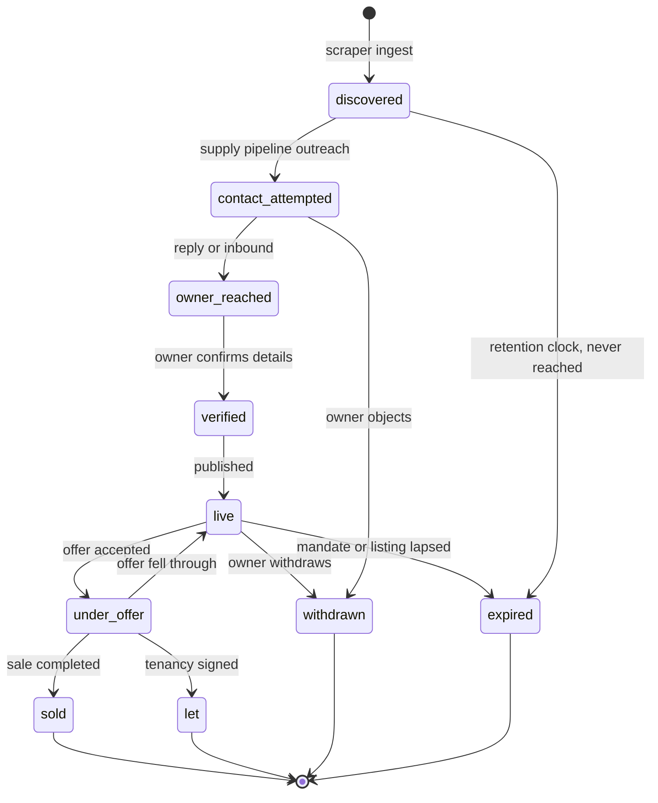

Transitions are guarded (e.g. `verified → live` requires an owner-confirmed price and at least one rights-cleared media asset for self-serve owners; staff can override with a recorded reason). Every transition writes `LISTING_CHANGE` + `ACTIVITY` + an outbox event; `live` triggers match evaluation.

### Dispatch offer

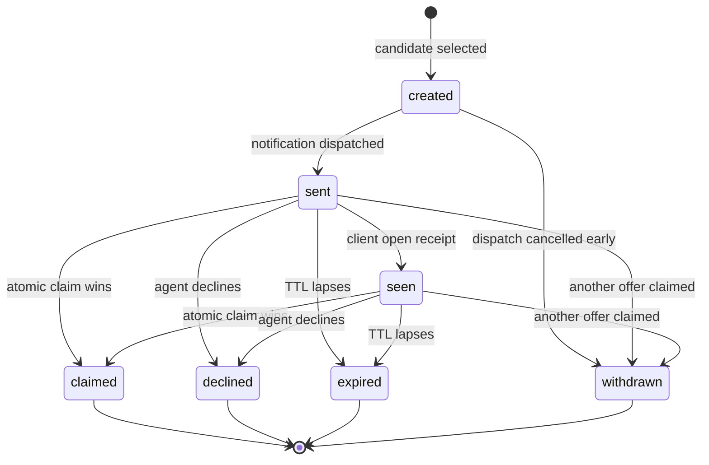

The parent `DISPATCH` machine: `pending → offering → claimed`, with `offering → escalated → offering` loops per the ladder (widen radius → relax criteria → alert ops), terminal `no_agent` fallback, and `cancelled` from any non-terminal state. Agent cancellation or no-show after claim re-opens a fresh dispatch automatically.

### Appointment

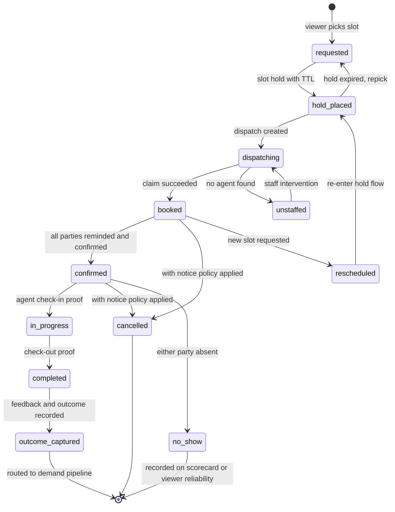

`cancelled` and `no_show` carry a `by_party` attribute (viewer / agent / staff) rather than being separate states — the penalty and scorecard logic branch on it, the lifecycle does not.

### Agent status

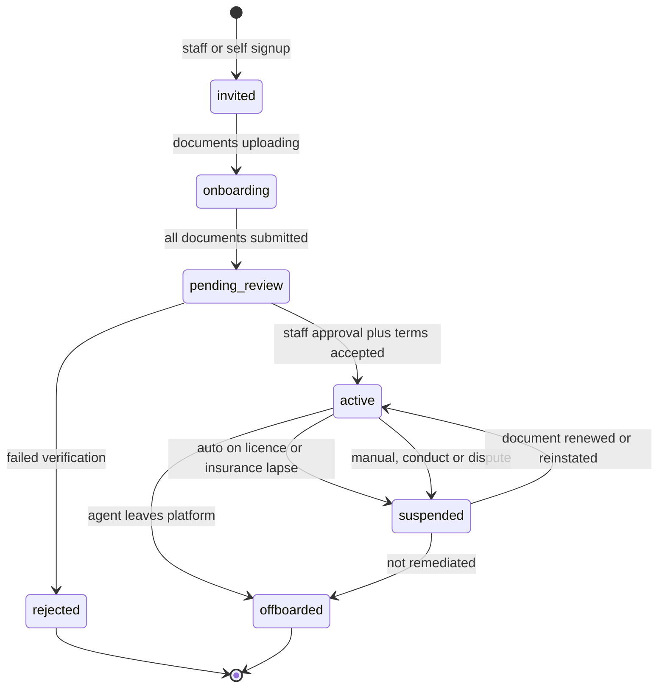

`suspended` carries a `reason` (`doc_lapse_auto`, `manual`) — auto-suspension is reversed automatically when a renewed document is verified; manual suspension requires staff action. Suspension in any form removes dispatch eligibility in the same transaction.

---

## 15 · Flagged risks (per working rules)

1. **Cold outreach to scraped contacts — legal risk, build accordingly.** ePrivacy rules in BE/FR/NL treat unsolicited email/SMS to individuals as requiring prior consent; phone has per-country opposition lists (Bloctel, Ne m'appelez plus). The sequencer therefore ships with a per-country **channel policy table that defaults to BLOCK** for electronic channels to non-consented contacts; unblocking a channel per country is a deliberate config change to be made only on legal advice. The compliance gate makes this enforceable, but the go/no-go itself needs counsel — not engineering.
2. **Agents as controllers (Art 26).** Once an agent receives owner/viewer contact details for a claimed showing they likely become an independent or joint controller. The schema is ready (versioned `TERMS_VERSION` can carry an Art 26 arrangement or C2C data-sharing terms, acceptance is evidenced), but the legal instrument must exist before launch.
3. **Legitimate interest for scraping.** The LIA reference is a required field on any `PROCESSING_ACTIVITY` with basis `legitimate_interest`, Art 14 disclosure is enforced by the pre-send gate, and unregistered-lead retention is deliberately short — but this processing pattern attracts DPA attention; the LIA should be written by counsel, not summarised by us.
4. **Backups vs erasure.** Solved by crypto-shredding (destroying the per-subject DEK makes identifier fields unreadable in all backups) plus suppression-list replay on restore. Trade-off to acknowledge: non-encrypted attributes (e.g. a free-text note containing a name) survive in old backups — mitigated by short backup retention and note-field hygiene rules.
5. **Geocoding dependency.** The canonical property key is derived from normalised address text, *not* geocoder output, so we are not hostage to geocoder versioning. But the geocoder is a processor receiving personal data (owner-linked addresses) — it must be an EU-hosted provider or on an SCC, and it goes in the `PROCESSOR` register from day one.

---

## 16 · What approval unlocks

Deliverable 2 (migration set with indexes justified against dispatch ranking + availability hot paths), then module implementation in the mandated order, each with tests before the next: contacts → properties/ingest → pipelines → appointments → agents → dispatch → notifications → privacy/audit → reporting.

**Points I'd most value review on:** (a) listing-as-episode vs. lifecycle-on-property, (b) the provenance resolver with parked `candidate_value` losers, (c) suppression as keyed HMACs, (d) `cancelled`/`no_show` as states with a `by_party` attribute rather than a state per party, and (e) crypto-shredding as the backup-consistency mechanism.
