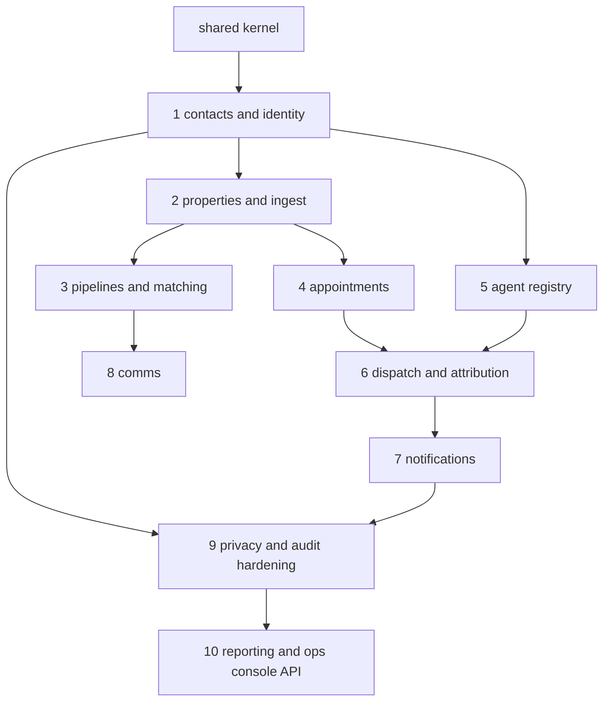

# Deliverable 3 — Module Implementation Plan

**Status: awaiting review.** The build order is mandated by the spec; this document adds per-module scope, dependencies, and the definition of done that gates progression ("each with tests before moving on").

---

## 1 · Project structure

One NestJS monorepo-style service (single deployable), modules as NestJS modules with enforced import boundaries (`eslint-plugin-boundaries`), so a later split into services is a deployment decision, not a rewrite:

```
crm/
├── db/migrations/           # raw SQL, node-pg-migrate (Deliverable 2)
├── src/
│   ├── shared/              # the kernel — no domain logic
│   │   ├── database/        # Kysely, tx helper, sync_seq
│   │   ├── outbox/          # transactional outbox writer + relay
│   │   ├── audit/           # PII-read interceptor, append-only writer
│   │   ├── provenance/      # the field resolver (single write path)
│   │   ├── jobs/            # BullMQ wrappers: TTL, SLA, cron
│   │   ├── auth/            # Keycloak JWT, ACR step-up guard, RBAC
│   │   └── i18n-time/       # tz-correct scheduling helpers, locales
│   ├── modules/
│   │   ├── contacts/        ├── properties/      ├── ingest/
│   │   ├── pipelines/       ├── matching/        ├── comms/
│   │   ├── appointments/    ├── agents/          ├── dispatch/
│   │   ├── notifications/   ├── privacy/         ├── access/
│   │   └── reporting/
│   └── api/                 # controllers, OpenAPI decorators, version gate
├── test/                    # integration (Testcontainers) + e2e contract
└── docs/                    # these deliverables
```

Rules the kernel enforces globally: every domain write goes through the transaction helper (which stamps `sync_seq`, writes outbox events, and rejects writes to `processing_restricted` contacts); every PII field read passes the audit interceptor; every provenance-bearing write goes through the resolver. Modules cannot bypass these without importing across a lint-fenced boundary.

## 2 · Build order & dependencies



Privacy is **not** actually last: the kernel ships with the audit writer, suppression check, `processing_restricted` gate and consent tables from step 0 (spec: "first-class, not a later addition"). Step 9 is the *completion* — DSR workflows, erasure propagation, retention purges, breach log.

## 3 · Per-module scope and definition of done

Common DoD for every module: migrations merged with the module; unit tests on state-machine guards; integration tests against real Postgres (Testcontainers); OpenAPI updated; events registered in the catalogue; fixtures extended (synthetic data only). Listed below is only what is *specific* to each module.

| # | Module | Scope (owns) | Specific definition of done |
|---|---|---|---|
| 0 | Shared kernel | tx helper, outbox + relay, audit writer/interceptor, provenance resolver, BullMQ jobs, Keycloak guard, version gate middleware | outbox relay survives crash-restart without loss or duplication (test); audit table rejects UPDATE/DELETE as `crm_app` (test) |
| 1 | Contacts & identity | contact, roles, channels, orgs, relationships, merge/unmerge, lifecycle machine, Keycloak linkage | merge→unmerge round-trip restores prior state exactly (property-based test); erased contacts unreachable through every list endpoint |
| 2 | Properties & ingest | property, listing + lifecycle, documents, media, ingest API, quarantine, provenance, suppression | idempotent re-ingest test (same batch twice → identical outcomes); suppression test (erased subject in batch → `suppressed`, no entity write); owner-submitted value survives a contradicting re-scrape |
| 3 | Pipelines & matching | pipelines, stages, SLA timers, tasks, scoring, activity timeline, requirement profiles, match engine | time-to-first-response SLA fires escalation under clock control (test); stage reconfiguration doesn't strand in-flight items; match engine respects `processing_restricted` |
| 4 | Appointments | access rules, slot generation, holds w/ TTL, booking, reschedule/cancel policies, open house, attendance, outcomes, iCal | DB-level double-booking rejection (test); min-notice enforced in property tz incl. DST boundary (test with Europe/Brussels fixtures); expired hold auto-releases |
| 5 | Agent registry | profiles, documents, coverage, absences, terms acceptance, scorecard MV, onboarding queue | doc-lapse auto-suspension removes dispatch eligibility in the same tx (test); scorecard refresh idempotent |
| 6 | Dispatch & attribution | candidate ranking, strategies, offers + TTL, **atomic claim**, escalation ladder, agreements, exclusivity, touches, disputes, commission statements | **the concurrency test**: N parallel claimers, exactly one winner, losers get `already_claimed`, replay idempotent; ranking p95 < 150 ms on fixture set of 1k agents; every candidate + rank + response persisted (audit query test) |
| 7 | Notifications | device registry, fallback chains, ACK tracking, preferences, quiet hours, provider adapters (FCM/APNs, SMS, email), DLQ | fallback escalation test (no ACK → next channel at timer; ACK halts chain); token pruning on provider `Unregistered`; quiet hours skipped for `critical_ack` |
| 8 | Comms | conversations, messages, templates/versions, sequencer, **pre-send gate**, Article 14 attach, inbound routing | gate is the only send path (architecture test: no provider adapter import outside gate); blocked-by-default country/channel policy verified; Art 14 proof row written on first indirect-contact outreach |
| 9 | Privacy & audit completion | DSR queue + one-month SLA, export assembly, erasure propagation, restriction, retention purges, breach log, Art 30 register, access grants completion | erasure propagation test end-to-end (suppression + Keycloak + DEK destroyed + re-ingest blocked); purpose-bound access expiry test (grant lapses → masked, reveal audit-logged); purge job honours per-category clocks |
| 10 | Reporting & ops APIs | funnel metrics, dispatch board feed, work queues, agent utilisation, comms performance, system health | metrics computed from pseudonymised store (no direct identifiers in reporting schema — test); board actions round-trip through the same audited write paths |

## 4 · Cross-cutting implementation rules

- **Explicit state machines**: every entity with >2 states gets a transition table in code (`from`, `to`, `guard`, `sideEffects[]`) — the single authority both the service layer and the OpenAPI docs are generated from. Illegal transitions are a typed domain error, never a silent no-op.
- **Clock injection everywhere**: no `new Date()` in domain code; a `Clock` service is injected so SLA/TTL/retention tests run under time control.
- **Events are facts, not commands**: modules communicate forward via outbox events (e.g. dispatch reacts to `appointment.awaiting_agent`), direct imports only down the dependency graph above.
- **Checkpoint cadence**: one review checkpoint per module — a short PR-level design note (what changed vs. this plan), then implementation. Deviations from the domain model get flagged in the note, not discovered in review.
